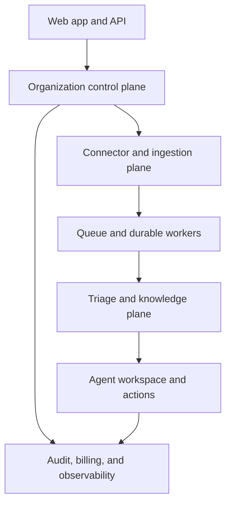
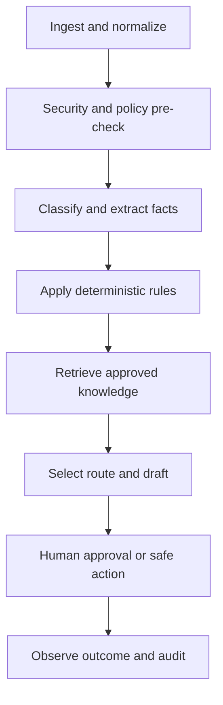

# ResolveFlow AI - Production SaaS Upgrade Plan

**Status:** Architecture proposal after reviewing the current Support Ticket Triage MVP and `gmail-multi-account-mcp-spec.md`  
**Target:** Private beta for real support teams, followed by a public multi-tenant SaaS

> **Execution track:** `FOUNDER_SAAS`. This document is for the founder-owned subscription product. For the first dedicated client deployment with no pricing or billing, use `RESOLVEFLOW_EXECUTION_TRACKS.md` and `RESOLVEFLOW_CLIENT_DEDICATED_PLAN.md` instead.

## 1. Executive decision

Do not turn the current MVP directly into a system that reads 50 live mailboxes.

Keep the proven triage graph, MCP knowledge lookup, safety rules, decision trace, and dashboard concepts. Build a new multi-tenant SaaS foundation around them:

1. Organization and user management.
2. Tenant-isolated support-channel connections.
3. Durable event ingestion and background jobs.
4. Departments, queues, SLAs, assignments, and versioned rules.
5. Organization-owned knowledge with citations and approval states.
6. Structured AI triage and grounded draft replies.
7. Human approval and provider-side actions.
8. Audit, privacy, usage metering, billing, and operational monitoring.

Build the production product UI in **Next.js with TypeScript**. Treat the current Streamlit application as a working prototype, evaluation harness, and visual reference only; do not extend Streamlit into the multi-tenant SaaS frontend. Keep the existing Python triage, RAG, MCP, and evaluation code behind authenticated service APIs so the proven AI behavior is migrated without a risky rewrite.

For the first private-beta onboarding, prove the workflow with **one shared Gmail support inbox through OAuth**, then allow the organization to add multiple explicitly connected shared/team mailboxes such as `support@`, `billing@`, `returns@`, and regional addresses. The data model, authorization layer, ingestion workers, and Next.js workspace must be multi-mailbox from the beginning. Do not bulk-connect employee mailboxes through domain-wide delegation; add that as an enterprise-controlled mode only after the shared-inbox SaaS is proven and the customer explicitly needs it.

## 2. Review of the attached Gmail MCP specification

### What should be preserved

- Explicit mailbox allowlists.
- Read-only by default.
- Code-level denial of write operations on read-only mailboxes.
- A mailbox parameter on every tool.
- Complete tool-call audit records.
- Remote MCP over Streamable HTTP.
- Secrets outside source control.
- Rate limits and limited initial scope.

### What must change for SaaS

| Current specification | Production change |
|---|---|
| One administered Workspace domain | Add `organization_id` to every connection, mailbox, ticket, job, rule, and audit event |
| One service-account credential | Use per-organization OAuth connections first; isolate any enterprise DWD credential per customer |
| Static environment allowlists | Store versioned mailbox permissions in the database with admin approval and audit history |
| One API key protects MCP | Use OAuth 2.1 for remote MCP with tenant/user identity, scopes, expiry, revocation, and rate limits |
| Supabase Edge Function does everything | Use Edge Functions for short callbacks/webhooks; use durable workers and a queue for sync, AI, attachments, and retries |
| Manual Gmail search/list tools | Add Gmail push notifications, history cursors, watch renewal, reconciliation, and idempotent ingestion |
| “By whom” audit with one shared token | Record authenticated actor ID, organization, role, request ID, purpose, and result |
| Broad `gmail.modify` assumption | Request the narrowest scopes needed by each connection and permission level |
| Claude is the main user | Make ResolveFlow the control plane; MCP becomes an optional integration surface for approved assistants |

There is also a scope inconsistency to resolve: the setup section authorizes `gmail.readonly`, while later write tools require compose/send/modify permission. Google classifies `gmail.readonly`, `gmail.compose`, and `gmail.modify` as restricted scopes; storing or transmitting restricted Gmail data on a server can require verification and a security assessment. Plan this work early rather than at launch.

## 3. Target product architecture



### Recommended implementation

| Concern | Recommended component |
|---|---|
| Web UI | Next.js App Router + React + TypeScript. Use the Streamlit screens only as a workflow and acceptance-test reference |
| UI system | Tailwind CSS + shadcn/ui/Radix primitives, a small token-based design system, Lucide icons, and accessible data-table/chart components |
| Client data | Server Components for initial authenticated reads; TanStack Query for live/interactive server state; URL-backed filters for shareable queue views |
| Forms/validation | React Hook Form + Zod, with the same schemas shared at API boundaries where practical |
| Authentication | Supabase Auth initially; enterprise SAML/SCIM later |
| Database | Supabase Postgres with Row Level Security and `organization_id` on every tenant-owned row |
| File storage | Private Supabase Storage buckets for KB files and permitted attachments |
| Short webhooks/callbacks | Supabase Edge Functions or a small API service |
| Long-running work | Cloud Run worker or equivalent durable container worker |
| Queue | Cloud Tasks, Pub/Sub, or another queue with retries and dead-letter handling |
| AI gateway | Tenant-aware multi-provider gateway with a canonical structured-output contract, per-workload routing, health checks, budgets, and audited fallback |
| Initial model providers | OpenAI, Anthropic/Claude, Google Gemini, Azure OpenAI, AWS Bedrock, and NVIDIA NIM; add Mistral, Cohere, Groq, Together AI, OpenRouter, and custom OpenAI-compatible endpoints through the same adapter contract |
| AI credentials | Organization-owned BYOK credentials stored only in a managed secret store; separate least-privilege inference and optional usage/billing credentials |
| Retrieval | Postgres full-text plus pgvector hybrid retrieval, versioned and filtered by organization |
| Secrets | Managed secret store; OAuth refresh tokens and organization LLM credentials envelope-encrypted with tenant-scoped references |
| Metrics/errors | OpenTelemetry-compatible traces, structured logs, error tracking, and product usage events |
| MCP | Separate tenant-aware Streamable HTTP gateway using OAuth 2.1 |

The MCP server should not be the database or the job runner. It is an authorized interface that calls the same application services used by the UI and API.

### Frontend decision and migration boundary

**Decision:** use Next.js for the production UI. It is the best fit for a polished multi-page SaaS because it supports authenticated routing, server rendering, responsive application layouts, route-level loading/error states, API integration, and a mature React component ecosystem. A separate Vite React SPA would also work, but Next.js reduces the amount of routing, rendering, and deployment infrastructure the team must assemble. Do not introduce another frontend framework unless a measured limitation appears.

The production boundary is:

- **Next.js owns:** sign-in, onboarding, organization switching, queues, ticket detail, knowledge management, quality checks, settings, billing surfaces, responsive navigation, and user-facing status/error states.
- **Python services own:** ticket normalization, provider-neutral model classification, deterministic guardrails, MCP retrieval, reranking, grounded answer generation, citation validation, evaluation, and background processing.
- **Postgres/Supabase owns:** tenant identity, authorization policy, durable product data, realtime events where useful, and pgvector-backed knowledge retrieval.
- **Streamlit owns temporarily:** local demos, internal diagnostics, and regression comparison during migration. Remove it from the production deployment after feature parity and acceptance gates pass.

Frontend quality requirements:

- Meet WCAG 2.2 AA for contrast, keyboard navigation, focus visibility, labels, error messaging, and reduced-motion behavior.
- Design mobile, tablet, laptop, and large queue-monitor layouts; do not make the ticket workspace desktop-only.
- Give every input, select, combobox, upload control, and destructive confirmation a visible border, label, focus ring, validation state, and disabled/loading state.
- Use skeletons for initial loading, optimistic UI only for safely reversible actions, actionable empty states, and retryable error states.
- Keep ticket filters, sort, pagination, and selected ticket in the URL so views survive refresh and can be shared.
- Virtualize or paginate large queues and knowledge lists; never render an unbounded ticket batch in the browser.
- Never expose model secrets, OAuth tokens, service-role keys, raw provider payloads, or unrestricted organization identifiers to the client.
- Add component tests, accessibility checks, responsive visual regression tests, and end-to-end tests for the critical agent journey.

## 4. How a real company uses the product

### Onboarding journey

1. **Create workspace** - company name, region, timezone, business hours, default language, and retention period.
2. **Connect support channels** - start with `support@company.com`, then add other shared/team mailboxes individually through a clear OAuth consent flow.
3. **Assign each mailbox** - give it a display name, color, department owner, managers, permitted agents, business hours, SLA policy, and default reply identity.
4. **Choose permissions** - read-only, draft-only, or approved-send for each mailbox. Read-only is the default.
5. **Invite teammates** - email invitations, roles, departments, working hours, and capacity.
6. **Create departments** - Billing, Technical Support, Account & Security, Returns, VIP, or custom groups.
7. **Import knowledge** - Markdown, CSV, PDF, URLs, or manual articles; review chunks and publish approved versions.
8. **Configure rules** - urgency words, VIP customers, refund thresholds, products, countries, languages, security topics, and SLA targets.
9. **Run historical dry mode** - classify 50-200 past tickets without writing to Gmail or sending messages.
10. **Review scorecard** - route accuracy, unsafe automation count, draft acceptance, KB coverage, and false escalations.
11. **Enable live mode** - begin with classification, suggested assignment, and drafts. Keep sending human-approved.

### Daily agent experience

- Unified **All inboxes** queue plus mailbox- and department-specific queues, with priority, SLA, assignee, status, language, and confidence filters.
- Per-user new/unseen counts, incoming-message toasts, mailbox badges, and a clear `New since your last visit` divider without changing Gmail's shared read state.
- Ticket detail with full thread, receiving mailbox, customer context, knowledge citations, rules triggered, and agent trace.
- AI draft that can be edited, approved, rejected, or regenerated with an explicit reason.
- One-click assign, merge, snooze, tag, escalate, transfer between departments, and resolve.
- Reply composer locked to an authorized mailbox/send-as identity, with visible `From` address, draft state, approval state, and send confirmation.
- Presence and collision protection showing who is viewing, drafting, or has already replied so two agents do not send duplicate answers.
- Side-by-side “why routed here” evidence without private chain-of-thought.
- Manager review queue for low-confidence, high-value, angry, security, legal, and policy-exception cases.

### Multi-mailbox workspace UI

The Next.js workspace uses a consistent three-pane layout on large screens and a progressive drill-down on smaller screens:

1. **Workspace navigation** — All inboxes, department groups, individual mailbox names/colors, new and SLA-risk badges, connection-health indicator, and saved views.
2. **Ticket queue** — sender, subject/preview, receiving mailbox, department, assignee, priority, status, age, SLA countdown, attachment indicator, and last activity. Filters and selection remain in the URL.
3. **Conversation workspace** — complete permitted thread, internal notes, customer/organization context, AI summary, citations, route trace, and reply composer.

Owners and admins also get an **Inbox operations** dashboard showing, per mailbox and department:

- received, replied, resolved, reopened, pending, unassigned, and overdue counts
- new-ticket and reply volume over time
- median first-response and resolution time
- SLA breach rate and current at-risk tickets
- agent workload, assignments, replies, and approval activity
- AI draft acceptance, fallback, knowledge coverage, and estimated model cost
- connector health, last successful sync, watch expiry, sync lag, and ingestion errors

The overview may show aggregate counts to authorized leaders while message content remains protected by mailbox/department permissions. Every count links to the exact filtered queue behind it; avoid decorative metrics that users cannot investigate.

## 5. Users, teams, departments, and permissions

### Roles

| Role | Permissions |
|---|---|
| Owner | Billing, security, integrations, organization deletion, all settings |
| Admin | Users, departments, channels, KB, rules, reports |
| Manager | Queue configuration, assignment, approval, QA, reporting |
| Agent | View permitted queues, edit/approve drafts, reply when authorized |
| Analyst/Auditor | Read-only reports, traces, and audit events |

Roles are organization-scoped. Department membership further limits which tickets and knowledge a user can access. Never trust a client-supplied `organization_id`; derive it from the authenticated membership on the server.

### Department model

Each department contains:

- name, description, color, active state
- manager(s) and agent members
- supported categories, channels, products, countries, and languages
- business hours and holidays
- SLA targets by urgency
- assignment strategy: manual, round-robin, least-loaded, skill-based
- escalation department and on-call contact
- department-specific knowledge visibility
- rule overrides and approval thresholds

### Mailbox access and visibility

Each mailbox has a department owner plus explicit viewer, triager, drafter, approver, and sender permissions. Organization owners do not automatically receive unrestricted message-body access if company policy separates HR, legal, executive, security, or personal mail. Provide separate permissions for viewing aggregate operational metrics and viewing message content.

Agents see only permitted mailboxes/queues. Managers may see their departments and aggregate organization benchmarks. Admins manage connectors and permissions. Owners control organization policy, but sensitive-mailbox content access must still be explicit and audited. All authorization is enforced server-side and through Postgres RLS; hiding a mailbox in navigation is not an authorization control.

Use ResolveFlow-specific per-user `seen_at` state for new/unseen UI badges. Do not treat Gmail's mailbox-level `UNREAD` label as equivalent to whether every ResolveFlow agent has seen a ticket. Preserve provider read state separately and only mutate it when the mailbox action policy explicitly allows that operation.

## 6. Rule engine

Rules must be deterministic, inspectable, versioned, testable, and separate from the LLM.

### Rule structure

```text
WHEN conditions match
IF exclusions do not match
THEN set category / priority / department / SLA / tags / approval requirement
STOP or continue according to explicit rule priority
```

Example conditions:

- channel, connected mailbox, sender domain
- subject/body phrase or regular expression
- detected intent, language, sentiment, and confidence
- customer tier, order value, product, country
- attachment presence/type
- business hours or ticket age
- knowledge match score
- previous contact count or reopened state

Example actions:

- set priority and category
- route to department or named queue
- assign an agent
- require manager approval
- prevent draft/send
- add provider label/tag
- start an SLA timer
- notify Slack/Teams/email

Every published ruleset needs a version, author, timestamp, test fixtures, dry-run diff, conflict warning, rollback, and immutable execution snapshot on each ticket.

## 7. Production triage graph



### State produced for every ticket

- category, subcategory, urgency, sentiment, language
- department and recommended assignee
- extracted entities such as order reference, product, dates, and requested action
- risk flags and deterministic rule codes
- classification confidence and retrieval confidence
- cited knowledge article IDs and versions
- route: `AUTO_TAG`, `DRAFT`, `CLARIFY`, `ESCALATE`, or later `AUTO_SEND`
- reply draft, internal summary, and missing-information questions
- SLA due time and breach risk
- complete trace of model, tool, rule, user, and provider actions

### Safety requirements

- Treat ticket content and attachments as untrusted input.
- Never let text inside a ticket change system instructions or tool permissions.
- Tool authorization is checked in code immediately before every action.
- High-risk tickets cannot auto-send.
- Model or retrieval failure defaults to human review.
- No private chain-of-thought is stored; retain concise decision evidence.
- Redact secrets and sensitive values before model calls where possible.
- Use idempotency keys for every provider mutation.

### Multi-provider AI gateway and bring-your-own-key

Each organization may connect and pay its preferred model providers directly. ResolveFlow must never require a customer's raw LLM key in browser code, logs, analytics, support exports, or database columns. The Next.js UI sends a new credential once to a server-only endpoint; the backend validates it with the provider, stores it in a managed secret store, and persists only a masked label, provider account metadata, secret reference, status, and timestamps.

Initial first-class adapters:

- OpenAI
- Anthropic/Claude
- Google Gemini
- Azure OpenAI
- AWS Bedrock
- NVIDIA NIM
- Mistral, Cohere, Groq, Together AI, and OpenRouter
- a restricted custom OpenAI-compatible endpoint for approved cloud or self-hosted deployments

Use a capability registry instead of assuming every provider behaves like OpenAI. Record whether each model supports structured JSON, tool use, streaming, required context size, regional processing, prompt caching, usage metadata, and the selected data-retention policy. Provider model lists and prices change frequently, so refresh them from provider APIs or an audited catalog rather than hard-coding names throughout the application.

#### Provider settings UI

Owners and admins get an **AI providers** settings page with:

- connect provider, test connection, rename, rotate, disable, and delete
- a masked credential fingerprint and last successful validation time; never reveal the key again
- available models and a capability/region/privacy summary
- separate defaults for classification, response drafting, embeddings, reranking, and evaluation
- drag-and-drop fallback order with an explicit maximum cost and quality tier
- current status: healthy, rate-limited, quota exhausted, authentication failed, disabled, or unknown
- requests, tokens, latency, errors, estimated cost, configured budget remaining, and last data refresh
- provider-reported spend or credit balance only when the provider exposes it and the customer grants the required billing/admin scope
- links to the provider's own billing console when exact balance is unavailable

Do not label an estimate as **credit remaining**. Show one of three clearly identified values:

1. **Provider-reported balance/spend** — authoritative but possibly delayed.
2. **ResolveFlow-tracked usage and estimated cost** — calculated from response token metadata and a versioned price catalog.
3. **ResolveFlow budget remaining** — the customer's internal cap minus tracked usage; this is a safety control, not the provider's actual account balance.

A normal inference API key often cannot read organization billing. OpenAI and Anthropic usage/cost reporting requires appropriate organization/admin credentials; Google billing visibility uses Google Cloud billing permissions rather than the Gemini inference key; other providers may expose only request usage or a web-console balance. Usage integrations must therefore be optional, least-privilege, provider-specific, and honest about freshness and authority.

#### Routing and fallback policy

Configure routing per workload, not as one global model dropdown. A policy contains an ordered provider/model list, maximum attempts, timeout, retry budget, cost ceiling, required capabilities, allowed regions, and minimum quality tier.

Fallback may occur for timeout, transient 5xx, rate limit, unavailable model, exhausted provider quota, or an invalid/revoked credential. It must not bypass a safety refusal, content policy decision, tenant budget block, required-region rule, or unsupported capability. Every attempt records the selected model, reason, latency, token usage, cost estimate, error class, and fallback decision without recording secrets or private chain-of-thought.

Use circuit breakers and cooldowns so an exhausted provider is not retried for every ticket. Preserve a safe human-review route when all allowed models fail. Notify organization admins before budget exhaustion, credential expiry where detectable, sustained rate limiting, and fallback activation.

Classification and drafting may fail over between qualified models through one canonical Zod/JSON schema and conformance tests. Embeddings require stricter handling: never query an index with a different embedding model or dimension. Pin every knowledge index to an embedding profile and either fall back to a compatible endpoint for that exact model or use a separately built index. Rerankers likewise need an explicit compatible fallback.

Before a provider/model can become a production default, run the organization's golden evaluation set and compare route accuracy, unsafe automation count, citation grounding, schema validity, latency, and cost against the current approved model. Material model changes require an approval record and rollout/rollback plan.

## 8. Knowledge system

Organizations need their own governed knowledge base, not one global FAQ file.

### Lifecycle

`DRAFT -> REVIEW -> PUBLISHED -> RETIRED`

### Required capabilities

- Upload Markdown, CSV, PDF, and copied help-center text.
- Extract and chunk content with source, page/section, checksum, and version.
- Assign article owner, department, product, locale, and effective dates.
- Prevent draft/retired content from grounding customer replies.
- Hybrid lexical/vector retrieval filtered by organization and permissions.
- Return article ID, title, version, excerpt, and score with every match.
- Flag unanswered ticket clusters as knowledge gaps.
- Re-index asynchronously and atomically switch to the new published version.
- Evaluate retrieval against labeled questions before publication.

## 9. Draft reply generation

Generate drafts only after classification, rules, and knowledge retrieval.

Inputs should include only:

- normalized ticket/thread
- permitted customer/order facts
- approved knowledge excerpts with citations
- organization tone guide
- channel formatting rules
- prohibited claims/actions
- requested output schema

Structured output:

```json
{
  "subject": "",
  "body": "",
  "citations": ["KB-ARTICLE-ID@VERSION"],
  "missing_information": [],
  "risk_flags": [],
  "requires_approval": true
}
```

Validate every draft for unsupported policy claims, promised refunds/credits, sensitive-data requests, prohibited language, and missing citations. Initially, save the draft inside ResolveFlow and optionally create a Gmail draft only after an agent approves.

### Automation levels

| Level | Behavior |
|---|---|
| 0 - Observe | Classify historical/live tickets without provider changes |
| 1 - Organize | Apply internal queue, priority, SLA, and suggested assignment |
| 2 - Draft | Generate grounded replies; humans edit and approve |
| 3 - Assisted action | Apply provider labels/create drafts after approval |
| 4 - Controlled auto-resolution | Auto-send only allowlisted low-risk intents with strong evidence and continuous QA |

New organizations start at Level 0 or 1. Level 4 is not part of the first production release.

## 10. Gmail integration strategy

### Mode A - SaaS multi-mailbox OAuth (build first)

- An organization admin connects one or more shared/role Gmail mailboxes explicitly; each connection is independently named, colored, assigned, permissioned, paused, reauthorized, or disconnected.
- Request offline access and store each refresh token encrypted with an organization- and connection-specific secret reference.
- Offer separate read-only, draft-only, approved-send, and permitted send-as identity settings per mailbox.
- Create and renew an independent Gmail `watch` for every connected mailbox while allowing events to arrive through shared Cloud Pub/Sub infrastructure.
- Persist a separate `historyId`, watch expiry, sync status, and reconciliation schedule per mailbox.
- Run periodic reconciliation because push events may be delayed or dropped.
- Deduplicate on organization, connection, mailbox, Gmail message/thread ID, and history event.
- Normalize all messages into the unified ticket domain while retaining their source mailbox and immutable provider identifiers.
- Reply only through the ticket's authorized source mailbox or an explicitly verified send-as identity; never silently send from another connected account.
- Apply per-mailbox rate limits, sync concurrency, kill switches, and health alerts so one failing inbox does not block the organization.
- Support one operator handling up to 50 connected mailboxes through bulk status views, connection setup progress, saved mailbox groups, global search, and efficient pagination; never render or poll every mailbox independently in the browser.

Connection semantics must be explicit:

- A real Gmail/Workspace user mailbox gets its own OAuth authorization, token reference, watch, history cursor, health state, and provider identity. An organization admin may initiate the setup, but the mailbox owner/authorized account must complete OAuth unless approved enterprise DWD is used.
- A Gmail send-as alias is not treated as an independent inbox. Map inbound recipient headers to the alias where reliable, verify it through the parent mailbox's send-as configuration, and use the parent mailbox connection for watch/history operations.
- A Google Group or Collaborative Inbox is not assumed to behave like a Gmail user mailbox. For the beta, ingest mail delivered/forwarded into an explicitly connected mailbox; add a dedicated Google Groups connector only after its permissions, threading, assignment, and reply semantics are tested.
- The setup UI must identify the connection type and explain exactly what will be read, watched, drafted, or sent before consent.

### Mode B - Enterprise Workspace installation/DWD (later)

- Require a Workspace administrator.
- Show exact scopes and a generated admin setup checklist.
- Require an approved mailbox allowlist; never accept any same-domain address implicitly.
- Isolate each customer's credential/configuration and encryption context.
- Keep read/write mailbox permissions in the database and enforce them immediately before each Gmail call.
- Add an organization-wide kill switch and per-mailbox revoke/disconnect.
- Exclude HR, executive, legal, and personal mailboxes by default.
- Require purpose, retention policy, employee notice/consent confirmation, content-access policy, and a reviewed allowlist before onboarding employee mailboxes.
- Permit organization-wide operational aggregates without granting every leader access to every employee message body.

Google's Marketplace configuration supports both individual and domain-wide installs, but public apps using sensitive/restricted scopes need the appropriate OAuth review. Gmail body-read scopes are restricted, and server-side storage/transmission can trigger a security assessment. This is a launch dependency, not a coding task that can be finished at the end.

## 11. MCP in the production product

MCP remains useful for two purposes:

1. Internal agent tools such as `search_knowledge_base`, `get_ticket_context`, and guarded draft/action tools.
2. An optional customer connector so approved Claude or other MCP clients can inspect or act on ResolveFlow tickets.

The remote endpoint should use OAuth 2.1 rather than a single shared API key. Access tokens must contain or resolve to organization, user/service identity, granted scopes, and expiry. Every call must re-check organization membership, mailbox/department access, and action permission.

Suggested tools:

- `list_queues`
- `search_tickets`
- `get_ticket`
- `search_knowledge_base`
- `create_internal_note`
- `create_reply_draft`
- `assign_ticket`
- `apply_tag`
- `request_human_approval`

Do not expose `send_reply` until the approval and idempotency systems are production-proven.

## 12. Core data model

Every tenant-owned table includes `organization_id`, timestamps, and appropriate retention/deletion behavior.

### Identity and control

- `organizations`
- `users`
- `organization_memberships`
- `invitations`
- `roles` / `permissions`
- `departments`
- `department_members`
- `business_hours` / `holidays`

### Connections and ingestion

- `channel_connections`
- `mailboxes`
- `mailbox_departments`
- `mailbox_memberships` / `mailbox_permissions`
- `mailbox_send_identities`
- `mailbox_sync_states`
- `oauth_credentials` or credential references
- `sync_cursors`
- `webhook_events`
- `ingestion_jobs`
- `provider_actions`
- `ai_provider_connections`
- `ai_credential_references`
- `ai_model_catalog`
- `ai_routing_policies`
- `ai_provider_health`

### Support domain

- `contacts`
- `conversations`
- `messages`
- `attachments`
- `tickets`
- `assignments`
- `sla_events`
- `internal_notes`
- `user_ticket_seen_state`
- `ticket_presence_leases`
- `reply_composer_leases`

### Intelligence and governance

- `triage_runs`
- `classifications`
- `rule_sets`
- `rules`
- `rule_executions`
- `knowledge_sources`
- `knowledge_articles`
- `knowledge_versions`
- `knowledge_chunks`
- `retrieval_events`
- `reply_drafts`
- `approvals`
- `human_feedback`
- `evaluation_cases` / `evaluation_runs`

### Commercial and audit

- `billing_customers`
- `subscriptions`
- `subscription_items`
- `plan_entitlements`
- `entitlement_overrides`
- `usage_events`
- `usage_ledger`
- `monthly_usage_counters`
- `invoices`
- `model_invocations`
- `model_cost_ledger`
- `provider_usage_snapshots`
- `budget_policies`
- `audit_events`
- `data_export_requests`
- `deletion_requests`

Use unique provider IDs and idempotency keys. Preserve immutable inbound provider events separately from mutable ticket workflow state.

## 13. Reliability and operational requirements

- At-least-once ingestion with idempotent consumers.
- Queue retries with exponential backoff and dead-letter handling.
- Per-organization concurrency and rate limits.
- Gmail/provider quota handling and `Retry-After` compliance.
- Independent mailbox watches, cursors, reconciliation, health state, and failure isolation.
- Per-user unseen counters derived from durable ticket events, with reconnect-safe realtime updates.
- Optimistic concurrency and idempotency checks preventing duplicate replies from simultaneous agents.
- Transactional outbox for provider writes and notifications.
- Watch-renewal and reconciliation jobs.
- Health dashboards for channel connection, sync lag, queue depth, AI latency, failure rate, and spend.
- Circuit breakers for model/provider failures.
- Model timeout plus safe fallback route.
- Per-workload provider/model routing with bounded retries, circuit breakers, and cooldowns.
- No fallback across incompatible embedding profiles or prohibited regions/capabilities.
- Provider usage sync is asynchronous and records source, authority, collection time, and expected reporting delay.
- Point-in-time database recovery and tested restore procedure.
- Status page and incident playbooks.
- Separate development, staging, and production projects/secrets/data.

Initial SLO targets:

- 99.9% control-plane availability after beta.
- 95% of new email tickets visible within 60 seconds.
- No cross-tenant data exposure.
- Zero unauthorized provider writes.
- 100% of provider writes auditable and idempotent.

## 14. Security, privacy, and compliance baseline

- Row Level Security on every tenant-owned table.
- Deny-by-default service authorization.
- Per-organization envelope encryption for refresh tokens and DWD material.
- Key rotation and credential revocation procedures.
- LLM credentials stored as tenant-scoped secret-manager references, never plaintext database values.
- Separate inference credentials from optional admin/billing credentials and request the least privilege each integration supports.
- Server-only credential validation, masked UI display, access auditing, rotation reminders, and immediate revocation.
- Private storage buckets with short-lived signed access.
- Attachment type/size limits, malware scanning, and no automatic execution.
- No raw email body, tokens, or attachments in application logs.
- Audit every read of sensitive message content and every write action.
- Configurable retention with deletion propagation to indexes, caches, and backups according to policy.
- Privacy policy, terms, subprocessor list, DPA, incident response, DSAR/export/delete workflows.
- Consent and employee-notice requirements confirmed by each customer.
- Penetration test before broad public launch; annual assessment planning if required by Google scopes.

## 15. Product reporting

Managers should see:

- ticket volume and backlog by organization, department, channel, and individual mailbox
- received/replied/resolved/reopened/pending counts and reply volume per mailbox
- per-mailbox sync health, new/unseen workload, unassigned count, and SLA risk
- first response and resolution times
- SLA breach rate
- route/category accuracy from human corrections
- draft acceptance, edit distance, and rejection reasons
- automation rate by level
- unsafe auto-action count
- KB citation coverage and knowledge gaps
- escalations and reopening rate
- per-organization model usage and estimated cost
- cost, latency, failure, and fallback rate by provider/model/workload
- provider-reported spend/balance freshness where supported, clearly separated from estimated spend
- configured AI budget remaining and projected exhaustion date

Do not optimize only for automation rate. The primary safety metric is **unsafe automation count**, with a target of zero.

## 16. Pricing, billing, and plan controls

### Pricing position

ResolveFlow should compete as an **AI-native, email-first support operations workspace with customer-controlled model costs**. Do not copy the expensive per-agent-plus-AI-outcome structure of larger omnichannel suites. Charge a predictable workspace subscription based mainly on processed support volume, include generous team access and multiple inboxes, and include BYOK orchestration without a per-AI-answer fee.

This is an initial go-to-market recommendation, not a permanent price promise. Validate conversion, gross margin, support burden, willingness to pay, and retention with beta customers before publishing long-term contracts.

### Competitive benchmark

Public annual or standard prices checked in September 2026 show the market range:

| Product | Public pricing signal | Implication for ResolveFlow |
|---|---|---|
| Freshdesk | $19 / $55 / $89 per agent/month | Entry pricing is low, but advanced routing and enterprise controls become expensive per seat |
| Zendesk | $19 / $55 / $115 per agent/month; Copilot listed separately | Avoid stacking a large AI fee on top of every agent |
| Front | $25 / $65 / $105 per seat/month; AI add-ons may be separate | ResolveFlow can win on multi-inbox visibility and included AI orchestration |
| Intercom | $29 / $85 / $132 per seat/month plus AI outcome charges from $0.99 | Predictable BYOK pricing is a strong contrast |
| Gorgias | Ticket-volume plans around $60 for 300, $360 for 2,000, and $900 for 5,000 tickets monthly | Volume pricing is understandable, but ResolveFlow should offer materially better value outside ecommerce |

Competitors change pricing frequently. Recheck official pricing pages before launch, show all taxes/overages before checkout, and never advertise savings using an outdated comparison.

### Recommended launch plans

Prices are USD. The annual equivalent is billed yearly and is approximately 20% below month-to-month pricing.

| Plan | Monthly | Annual equivalent | Included team | Live inboxes | Processed tickets/month | BYOK model connections | Data retention | Best fit |
|---|---:|---:|---:|---:|---:|---:|---:|---|
| Sandbox | $0 | $0 | 1 user | No live inbox | 250 CSV/manual tickets | 1 | 7 days | Product evaluation and demos |
| Starter | $49 | $39/month | 5 full + 5 light users | 2 | 2,000 | 2 | 90 days | Small support team |
| Team | $199 | $159/month | 20 full + 20 light users | 10 | 10,000 | 5 | 12 months | Growing multi-department company |
| Business | $599 | $479/month | 75 full + unlimited light users | 50 | 50,000 | Unlimited | 36 months | High-volume support operation |
| Enterprise | Custom annual contract | Custom | Custom | Custom | Committed volume | Unlimited | Custom | SSO/SCIM, DWD, regional hosting, custom security and SLA |

Seats, inbox capacity, and processed-ticket volume are independent entitlements. A customer does not need to buy unused seats merely to connect many mailboxes, and a large team does not need to buy unused mailbox capacity. Included inboxes are the base allowance; capacity packs can raise the mailbox limit without changing the plan's users or feature tier.

A **full user** can triage, draft, approve, manage, or reply according to role. A **light user** can view permitted dashboards/tickets, add internal notes, and participate in approvals but cannot independently send customer replies. Organization owners and billing contacts who only administer subscriptions should not consume a full seat.

Recommended feature packaging:

- **Sandbox:** sample/CSV workflows, limited knowledge ingestion, evaluation report, no live OAuth, no production SLA.
- **Starter:** unified inbox, basic departments/rules/SLA, hybrid RAG, grounded drafts, two model connections, one fallback chain, standard analytics, human approval, and optional capacity for up to 50 actual mailboxes through a mailbox pack.
- **Team:** advanced routing, ten inboxes, workload assignment, multiple approval policies, quality checks, five model connections, workload-specific fallback, custom dashboards, API/webhooks, and one-year audit history.
- **Business:** custom roles, cross-department operations, advanced analytics, audit export, unlimited model connections, higher API limits, priority support, and longer retention.
- **Enterprise:** SAML/SCIM, enterprise DWD, legal/security review, regional data controls, custom retention, contractual uptime/support SLA, dedicated onboarding, and negotiated volume.

### Low-seat, high-mailbox configuration

A solo owner or a team of 2-10 people may connect and operate 50 authorized mailboxes in one workspace. They use the same unified queue, mailbox filters, unread indicators, routing, reporting, and correct reply identity as a larger company. Pricing is based on their selected base plan, processed-ticket volume, and a mailbox-capacity pack—not on pretending they have 75 employees.

Recommended examples:

| Example customer | Configuration | Monthly | Annual equivalent |
|---|---|---:|---:|
| Solo operator, up to 2,000 tickets | Starter + capacity up to 50 inboxes | $128 | $102/month |
| Team of up to 10, up to 10,000 tickets | Team + capacity up to 50 inboxes | $278 | $222/month |
| 50 inbox aliases delivered into one real mailbox | Starter; aliases are send/recipient identities, not 50 provider mailbox connections | From $49 | From $39/month |

The UI must make the distinction visible: **members** are people who use ResolveFlow, **mailboxes** are independently connected provider accounts with their own synchronization state, and **send identities/aliases** are addresses belonging to a connected mailbox. Billing must follow the same definitions.

For 50 separate Gmail accounts under one Workspace domain, support either 50 explicit OAuth authorizations or the later enterprise DWD connection mode with an enforced allowlist. DWD changes authorization and compliance requirements; it does not force the customer to buy more ResolveFlow user seats.

### Billable unit

A **processed ticket** is one new external customer conversation accepted into the live ResolveFlow workspace during the billing period.

- Multiple messages and replies in the same conversation do not create additional billable tickets.
- Internal notes, agent replies, provider sync retries, duplicate events, merged duplicates, spam, newsletters, delivery failures, and auto-replies are not billable.
- A conversation reopened within 30 days remains the same billable ticket; after 30 days of inactivity, a new customer request may start a new ticket.
- Historical imports used only in dry-run evaluation consume a separately displayed evaluation allowance, not live-ticket quota.
- Every usage counter must be inspectable and exportable so a customer can reconcile the invoice.

### Overage and expansion pricing

Keep service running when usage exceeds the allowance; do not stop receiving customer email. Notify at 70%, 85%, and 100%, provide a forecast, and let owners set a hard spend cap for non-ingestion features.

| Usage add-on | Starter | Team | Business |
|---|---:|---:|---:|
| Additional 1,000 processed tickets | $15 | $12 | $8 |
| Additional full user/month | $9 | $8 | $7 |

| Mailbox-capacity add-on | Monthly | Annual equivalent | Availability |
|---|---:|---:|---|
| Up to 10 total live inboxes | $20 | $16/month | Starter |
| Up to 50 total live inboxes | $79 | $63/month | Starter or Team; included in Business |
| Up to 100 total live inboxes | $129 | $103/month | Team or Business after operational review |

Mailbox capacity counts independently connected provider mailboxes, not verified aliases on the same underlying account. Include up to 10 send identities/aliases per connected mailbox before applying a reasonable high-volume configuration review.

At checkout and before an overage, show the expected charge and whether upgrading is cheaper. Never auto-upgrade a plan or activate a paid add-on without owner authorization. Inbound ingestion continues during billing disputes or caps, but optional AI generation and nonessential processing may pause according to a clearly disclosed grace policy.

### Trial and launch offer

- Offer a 14-day Team trial without a credit card, limited to two live inboxes and 1,000 processed tickets.
- Keep Sandbox available after the trial so prospects can continue testing with sample/manual data.
- For the first 10 design-partner organizations, offer 40% off the applicable paid plan for six months in exchange for scheduled feedback and permission to use anonymized product metrics; never require a public testimonial.
- Lock the subscribed base price for the first 12 months for those design partners, excluding explicitly disclosed overages and taxes.

### AI cost treatment

Use a model-cost ledger for every classification, embedding, reranking, evaluation, and drafting call. In BYOK mode, the customer pays the model provider directly while ResolveFlow meters product usage independently. ResolveFlow budgets, alerts, and hard stops must still protect the organization even when provider billing data is unavailable or delayed. Cache immutable results where safe, limit output tokens, and do not call the LLM separately for every graph node.

All paid plans include BYOK orchestration and do **not** add a ResolveFlow per-answer or per-token fee. Offer two clearly separated commercial modes:

1. **Bring your own key** — provider inference charges go directly to the customer's provider account.
2. **ResolveFlow-managed AI allowance** — an optional later product with an explicit included allowance, published unit rate, margin, and hard budget controls.

Never silently move a BYOK workload onto a ResolveFlow-paid key, a more expensive fallback, or a provider outside the organization's approved policy.

### Billing implementation requirements

Meter processed tickets, evaluation runs, full/light seats, connected live mailboxes, retained history, provider actions, storage, and optional managed AI. Enforce plan entitlements server-side.

- Use Stripe or an equivalent subscription platform for customers, subscriptions, invoices, taxes, coupons, trials, payment state, and a hosted billing portal.
- Store immutable usage-ledger entries plus reconciled monthly counters; do not calculate invoices from mutable dashboard aggregates.
- Make webhook consumers idempotent and verify webhook signatures.
- Apply upgrades immediately with a clear prorated preview; schedule downgrades for renewal unless the customer explicitly accepts an immediate capability reduction.
- Provide invoice history, usage export, cancellation, data-export, and deletion flows.
- Give at least seven days of payment-failure grace with visible notices before restricting nonessential features.
- Never delete or stop ingesting support mail merely because an invoice payment is retrying.

## 17. Delivery roadmap

### Phase 0 - Current-system audit (1-2 days)

- Map current code, schemas, dependencies, graph, MCP transport, and tests.
- Freeze golden fixtures and establish a baseline.
- Create a production threat model and data-flow diagram.
- Decide the first beta customer's exact Gmail connection mode.
- Record the Streamlit workflows as screenshots, fixtures, and acceptance criteria; freeze Streamlit feature development except critical fixes.

**Gate:** reproducible MVP tests and documented migration plan.

### Phase 1 - Multi-tenancy and team foundation (4-6 days)

- Add the tenant-scoped secret-vault abstraction, AI provider connection records, and audited credential lifecycle.
- Create the Next.js/TypeScript application shell, design tokens, responsive authenticated layout, and reusable accessible form/table primitives.
- Implement sign-in, onboarding, organization context, protected routes, and role-aware navigation without trusting client-supplied tenant IDs.
- Organizations, memberships, invitations, roles, departments, and RLS.
- Tenant-aware API and worker authorization.
- Organization settings, business hours, and audit events.

**Gate:** automated cross-tenant isolation tests pass for UI, API, worker, storage, retrieval, and MCP; the Next.js shell passes keyboard, contrast, responsive, and authenticated-route checks.

### Phase 2 - Real Gmail ingestion (5-7 days)

- Multiple explicit OAuth mailbox connections per organization, encrypted tokens, send identities, department mapping, and per-mailbox permission levels.
- Per-mailbox Pub/Sub watch, history cursor, renewals, reconciliation, deduplication, health, and failure isolation.
- Unified thread/message normalization retaining source-mailbox identity and attachment metadata.
- Per-user new/unseen state, realtime queue updates, and mailbox/department counters.
- Pause, reauthorize, disconnect, and deletion flows per mailbox plus an organization-wide connector kill switch.

**Gate:** duplicate/out-of-order webhook tests pass across at least two connected mailboxes; one mailbox failure does not block another; reconnect loses no message; unread indicators recover correctly; and no sync or reply crosses mailbox permissions.

### Phase 3 - Departments, queues, SLA, and rules (5-7 days)

- Versioned rule builder, priority/conflict behavior, dry run, rollback.
- Assignment strategies, production Next.js queue/ticket-detail UI, business hours, and SLA events.

**Gate:** every routing decision reproduces from stored input and ruleset version.

### Phase 4 - Knowledge and grounded drafts (6-8 days)

- Knowledge ingestion/versioning, hybrid retrieval, citations, KB evaluation.
- Structured triage and draft generation through the canonical multi-provider gateway.
- Provider settings UI, workload-specific model selection, bounded fallback, provider health, cost ledger, budgets, and alerts.
- Provider adapter conformance tests and organization golden-set qualification before model activation.
- Draft validation, approval workflow, feedback capture.
- Replace the Streamlit knowledge and quality-check screens with tenant-aware Next.js workflows and downloadable evaluation evidence.

**Gate:** zero unsafe actions on the security/adversarial golden set; draft citations resolve to published tenant knowledge.

### Phase 5 - Provider actions and operations (5-7 days)

- Approved Gmail draft creation, labels, and optional sending.
- Idempotency, outbox, retry/dead-letter UI.
- Monitoring, alerts, immutable usage metering, trials, subscriptions, transparent overages, billing entitlements, customer billing portal, and backups.

**Gate:** every external mutation is permission-checked, idempotent, and auditable.

### Phase 6 - Private beta and compliance (2-4 weeks overlapping)

- Onboard 1-3 real organizations in Level 0/1/2 mode.
- Compare AI decisions with historical/human decisions.
- Complete privacy/terms/DPA documentation.
- Start Google brand/scope verification and any required security assessment.

**Gate:** customer signs off routing quality, retention, access controls, and draft quality before broader release.

### Phase 7 - Public SaaS expansion

- Zendesk, Freshdesk, Intercom, Microsoft 365, web forms, Slack/Teams alerts.
- SAML, SCIM, audit export, regional data residency.
- Enterprise DWD and Workspace Marketplace listing.
- Controlled auto-resolution for narrowly allowlisted intents only.

## 18. Recommended first production release

Ship this first:

- multi-tenant organizations
- owner, admin, manager, and agent roles
- departments and queues
- multiple shared/team Gmail inboxes per organization with unified and mailbox-specific queues
- live email ingestion
- organization KB upload/publish
- deterministic rules and SLA
- AI classification, summary, and grounded drafts
- human approval
- internal audit trail
- historical dry-run evaluation
- self-service trial, subscriptions, transparent usage meter/overages, invoices, billing portal, and BYOK with no ResolveFlow per-answer fee
- secure BYOK provider connections with workload-specific model selection and safe fallback
- AI usage, estimated cost, provider-reported billing status where supported, and budget dashboard

Defer:

- reading 50 employee mailboxes
- automatic sending
- SAML/SCIM
- omnichannel integrations
- multilingual generation
- complex workflow builder
- marketplace publication until verification work is underway

## 19. Production-readiness acceptance gates

The system is not production-ready until all are true:

- Cross-tenant authorization and RLS tests pass.
- Provider tokens are encrypted, rotatable, revocable, tenant-scoped, and never returned to the browser after creation.
- Every enabled AI provider adapter passes the same structured-output, timeout, usage-accounting, privacy, and failure-classification contract tests.
- Fallback never bypasses safety, residency, capability, or budget policy, and all-provider failure safely routes to human review.
- Usage UI distinguishes authoritative provider data, ResolveFlow estimates, and internal budget remaining, including freshness timestamps.
- Multi-mailbox Gmail reconnect, independent watch renewal, history gaps, duplicates, out-of-order events, and failure isolation are tested.
- New/unseen counts are correct per user after refresh/reconnect and remain separate from provider unread state.
- Concurrent-agent tests prevent duplicate replies and unauthorized cross-mailbox sending.
- Aggregate manager analytics never expose restricted message content.
- Every provider write has permission check, approval evidence, and idempotency key.
- High-risk and prompt-injection fixtures never auto-send.
- Retrieval never crosses organization or unpublished-document boundaries.
- Rules are versioned, replayable, and reversible.
- Audit events identify actor, organization, target, purpose, and result.
- Retention/export/delete workflows are tested end-to-end.
- Monitoring, backups, recovery, incident response, and spend limits are operational.
- Processed-ticket, seat, inbox, and add-on counters reconcile with the immutable usage ledger and generated invoices.
- Billing webhooks are signature-verified and idempotent; duplicate/out-of-order events cannot double-charge or corrupt entitlements.
- Customers see trial limits, renewal date, projected overage, taxes where known, and proration before confirming a paid change.
- Google OAuth verification/security-assessment obligations have been confirmed for the selected scopes and launch model.
- Critical Next.js journeys pass keyboard-only, WCAG 2.2 AA contrast, responsive visual regression, and end-to-end tests.
- No production workflow depends on Streamlit; it is excluded from the customer-facing production deployment.

## 20. Immediate next build slice

The next slice should be **Tenant Foundation + Multi-Mailbox Workspace in Observe Mode**:

1. Scaffold the Next.js/TypeScript production app with the design system, authenticated responsive shell, and protected routes.
2. Add organization/user/membership/department tables and RLS.
3. Connect the Next.js session to server-derived organization context and prove that changing client parameters cannot cross tenant boundaries.
4. Add independently permissioned Google OAuth mailbox connections, initially validating two shared mailboxes in one organization with read-only access.
5. Ingest each mailbox through independent Pub/Sub watches/history cursors with shared durable workers and failure isolation.
6. Store normalized immutable messages and tenant-owned tickets while retaining source-mailbox identity.
7. Add per-user seen state, realtime new-ticket events, mailbox badges, and unified/mailbox-specific queue filters.
8. Expose the existing Python triage graph through an authenticated internal API and run it without provider writes.
9. Display the live queue, ticket, mailbox identity, citations, and trace in Next.js to authorized organization members only.
10. Add the first manager Inbox operations view with received, pending, unassigned, SLA-risk, and connector-health counts per mailbox.
11. Prove cross-tenant and cross-mailbox isolation, independent reconnect/delete behavior, and responsive/accessibility behavior.

Do not implement sends, bulk employee-mailbox DWD, billing, or extra channels until this slice is green. Draft UI may be prototyped, but provider-side draft creation and sending remain disabled during Observe Mode.

## Official implementation references

- Gmail push notifications and Pub/Sub: https://developers.google.com/workspace/gmail/api/guides/push
- Gmail OAuth scope classifications: https://developers.google.com/workspace/gmail/api/auth/scopes
- Gmail API mailbox, thread, draft, message, label, send-as, and watch resources: https://developers.google.com/workspace/gmail/api/reference/rest
- Gmail message sending and required scopes: https://developers.google.com/workspace/gmail/api/reference/rest/v1/users.messages/send
- Gmail delegation behavior and limitations: https://support.google.com/mail/answer/138350
- Google restricted-scope verification: https://developers.google.com/identity/protocols/oauth2/production-readiness/restricted-scope-verification
- Google Workspace Marketplace OAuth configuration: https://developers.google.com/workspace/marketplace/configure-oauth-consent-screen
- OAuth 2.0 web-server/offline access: https://developers.google.com/identity/protocols/oauth2/web-server
- MCP authorization: https://modelcontextprotocol.io/docs/2026-07-28/tutorials/security/authorization
- OpenAI organization usage and cost APIs: https://platform.openai.com/docs/api-reference/usage
- Anthropic Messages Usage Report API: https://platform.claude.com/docs/en/api/admin/usage_report/retrieve_messages
- Gemini API billing and usage: https://ai.google.dev/gemini-api/docs/billing
- Google Cloud Billing APIs: https://cloud.google.com/billing/docs/develop
- Amazon Bedrock cost attribution: https://docs.aws.amazon.com/bedrock/latest/userguide/cost-management.html
- NVIDIA NIM LLM APIs: https://docs.api.nvidia.com/nim/reference/llm-apis
- Freshdesk pricing: https://www.freshworks.com/freshdesk/pricing/
- Zendesk pricing: https://www.zendesk.com/pricing/
- Front pricing: https://front.com/pricing
- Intercom pricing: https://www.intercom.com/pricing
- Gorgias pricing: https://www.gorgias.com/pricing
